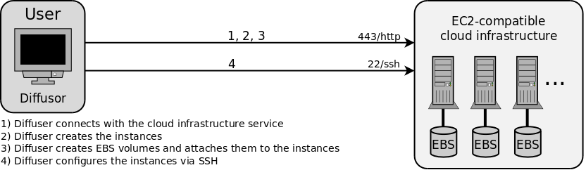

# Diffuser - Automatic cluster deployment tool for distributed filesystems in cloud infrastructures

Diffuser is an automatic cluster deployment tool for distributed filesystems in cloud infrastructures (IaaS).

It is designed to help users to deploy a bunch of virtual server instances inside AWS-compatible cloud infrastructures and connect them via popular distributed filesystems.

## Motivation for the development of Diffuser

Working with public or private cloud infrastructures (e.g. Amazon EC2, Eucalyptus, OpenNebula or Nimbus) is simple but deploying a cluster of virtual server instances that have a distributed filesystem already up and running is a complex and time-consuming task.

Diffuser is a command-line tool, written in Python, that is designed to automate this task and create an already connected cluster within minutes.

The following distributed filesystems are implemented inside Diffuser:

- [NFS](http://nfs.sourceforge.net)
- [https://www.gluster.org](GlusterFS) (with redundancy)
- [https://www.gluster.org](GlusterFS) (without redundancy)
- [Ceph](http://ceph.com)
- PVFS2 (which is the of [OrangeFS](http://www.orangefs.org))

It's easy to implement support for more distributed filesystems.

## The way Diffuser works

Diffuser is a command-line application. Python 2.5 or newer is required. The software uses [boto](https://github.com/boto/boto), a Python interface to the [Amazon Web Services](https://aws.amazon.com) to start the virtual server instances. The deployment and configuration of the distributed filesystem is done via the SSH module [paramiko](https://github.com/paramiko/paramiko).

When running Diffuser, the user need to select one of the supported distributed filesystems. The configuration parameters can be modified inside Diffuser's configuration file.

## Limitations

- A Public Cloud PaaS like Google's App Engine would be the perfect platform for running Diffuser but it is impossible because the App Engine does not allow to communicate via SSH. However, Diffusor can be run inside App Engine-compatible Private Cloud PaaS like [AppScale](https://github.com/AppScale/appscale/) or [typhoonAE](https://sites.google.com/site/gaeasaframework/typhoonae).
- Only [Ubuntu](http://www.ubuntu.com) 10.04 Server instances are supported because the effort to implement support for more operating systems is quite huge.
- It is impossible to implement support for all distributed filesystems. The installation of HDFS via scripting is too complicated. Shared Storage filesystems like [OCFS2](https://oss.oracle.com/projects/ocfs2/) and [GFS](http://www.sourceware.org/cluster/gfs/) require direct access to the storage device and thus cannot be used inside a cloud infrastructure. [Lustre](http://lustre.org) requires special Linux kernel versions and [GPFS](http://www.ibm.com/support/knowledgecenter/SSFKCN/gpfs_welcome.html) is not open source.
- The time, which is required to deploy a cluster is quite long for some filesystems (e.g. Ceph) because the Linux kernel needs to be build inside every instance and Diffuser does not operate in parallel mode.
